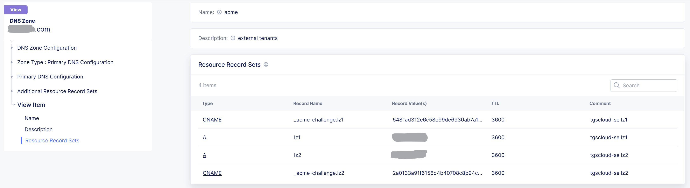
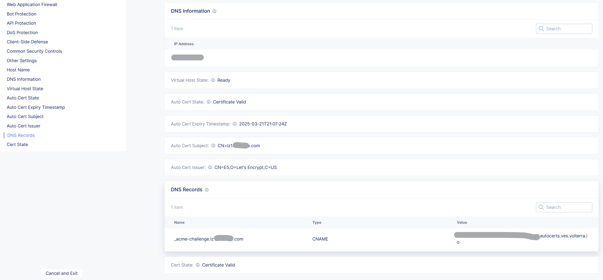

XC OIDC as a Shared service
####################################################################

F5 Distributed Cloud (XC) allows to insert any container based service in the data-path,
named **Platform as a Service** (PaaS).
F5 has pre-defined PaaS solutions based on our most reliable and proven world grade Reverse Proxy technology: NGINX.
The article `here <https://f5-k8s-ctfd.docs.emea.f5se.com/en/latest/class8/module2/module2.html>`_ describe the High Level Design of the PaaS **Secure Access** that enables a oAuth/OIDC GW to authenticate user access to your Web applications.

.. image:: ./_pictures/design.png
   :align: center
   :width: 700
   :alt: vK8S

This repository describes *How To Deploy* it with an Ansible role.

.. contents:: Contents
    :local:

Pre-requisites
*****************************************
- **XC Service Credential**: Create a Service Credential with admin right level on namespaces System, Shared and Applications. Doc `here <https://my.f5.com/manage/s/article/K000147166>`_.
- **XC blindfold secret**: Encrypt a shared Secret to authenticate traffic from F5 XC on you Origin Service. Vulnerability a SaaS offer is described `here <https://cybersecuritynews.com/waf-vulnerability-in-akamai-cloudflare-and-imperva/>`_. Secret encryption is done by using F5 Blindfold patent, doc `here <https://docs.cloud.f5.com/docs-v2/multi-cloud-network-connect/how-to/adv-security/blindfold-tls-certs>`_.
- **oAuth Redirected URIs**: On your Identy Providers (IdP) service console, aka oAuth Authorization Servers, allows the redirected URIs ``/_codexch`` for your protected apps. For example: ``https://*.f5xcdev.com/_codexch``
- **NGINX+ license**: Because jwt module is only available for Enterprise grade NGINX instances, download from your `MyF5 <https://account.f5.com/myf5>`_ your NGINX+ license (key, crt, jwt). Replace the ``./xc/files/nginx-license.jwt`` of this Ansible role folder.
- **XC DNS Primary** (option): delegate a DNS zone to F5 XC. Doc `here <https://docs.cloud.f5.com/docs-v2/dns-management/how-to/manage-dns-zones#create-secondary-zone>`_. Optionnal if you use an External DNS hosting.

1. Shared Service "PaaS Secure Access"
*****************************************

Build your licensed NGINX image
=========================================
Build the Docker file `here <https://github.com/nergalex/docker-nginx-oidc/tree/master/debian/nginx-unprivileged-r33_agent>`_
and Push the image to your private Container Registry.

Ansible playbooks: ``roles/xc/tasks``: ``build_nginx_oidc_image.yaml`` ; ``push_image.yaml``

.. code-block:: yaml

    extra_build_distri: debian
    extra_build_name: nginx-unprivileged-r33_agent

Configure F5 XC
=========================================
Deploy a "PaaS Secure Access" as a Shared Service for other Application namespaces, i.e. not isolated.

Example of Ansible playbooks in ``roles/xc/tasks``: ``create_vk8s_nginx_oidc.yaml``

==============================================  =============================================
variable                                        Description
==============================================  =============================================
``extra_build_name``                            image tag
``extra_namespace``                             targeted namespace that hosts the PaaS
``extra_virtual_site``                          Deploy on RE or CE
``extra_nginx_agent_server_token``              NGIXN One token
``extra_volterra.tenant.full``                  long tenant name
``extra_volterra.tenant.short``                 short tenant name
``extra_volterra.token``                        Service Credential >> API token
``stats_acr_login_server``                      Container Registry FQDN
``stats_acr_password``                          Container Registry credential
``stats_acr_username``                          Container Registry credential
``extra_azure.client_id``                       Azure App Client ID
``extra_azure.client_secret``                   Azure App Client Secret value
``extra_azure.tenant``                          Azure App ID
``extra_okta.client_id``                        Okta App Client ID
``extra_okta.client_secret``                    Okta App Client Secret value
``extra_okta.tenant``                           Okta tenant
``extra_okta.server_id``                        Okta Server ID / Authorization Server ID
==============================================  =============================================

2. Deploy an Application protected by "PaaS Secure Access"
**********************************************************

Example of Ansible playbooks in ``roles/xc/tasks``: ``create_vk8s_nginx_oidc.yaml``

==============================================  =============================================
variable                                        Description
==============================================  =============================================
``extra_build_name``                            image tag
``extra_namespace``                             targeted namespace that hosts the PaaS
``extra_virtual_site``                          Deploy on RE or CE
``extra_nginx_agent_server_token``              NGIXN One token
``extra_volterra.tenant.full``                  long tenant name
``extra_volterra.tenant.short``                 short tenant name
``extra_volterra.token``                        Service Credential >> API token
``stats_acr_login_server``                      Container Registry FQDN
``stats_acr_password``                          Container Registry credential
``stats_acr_username``                          Container Registry credential
``extra_azure.client_id``                       Azure App Client ID
``extra_azure.client_secret``                   Azure App Client Secret value
``extra_azure.tenant``                          Azure App ID
``extra_okta.client_id``                        Okta App Client ID
``extra_okta.client_secret``                    Okta App Client Secret value
``extra_okta.tenant``                           Okta tenant
``extra_okta.server_id``                        Okta Server ID / Authorization Server ID
==============================================  =============================================

3. External DNS
**********************************************************

If the application DNS domain is not delegated and managed by F5 XC,
so you'll have to create the DNS records on your DNS domain server:
- A <my-app> <XC-tenant-dedicated-IP>
- CNAME _acme-challenge.<my-app> <XC-my-app-CNAME>

You can get ``XC-tenant-dedicated-IP`` and ``XC-my-app-CNAME`` by calling the HTTP LB API endpoints `here <https://docs.cloud.f5.com/docs-v2/api/views-http-loadbalancer?searchQuery=http_lb#operation/ves.io.schema.views.http_loadbalancer.API.Get>`_

