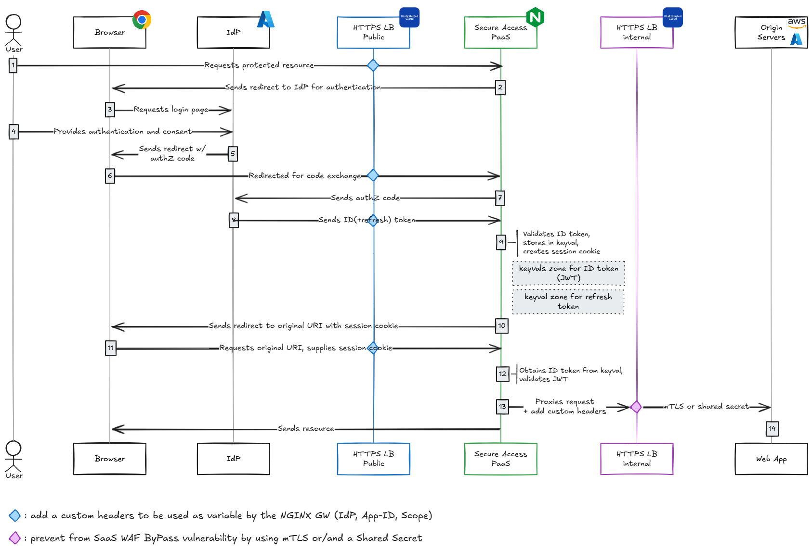

XC OIDC as a Shared service
####################################################################

F5 Distributed Cloud (XC) allows to insert any container based service in the data-path,
named **Platform as a Service** (PaaS).
F5 has pre-defined PaaS solutions based on our most reliable and proven world grade Reverse Proxy technology: NGINX.
The article `here <https://f5-k8s-ctfd.docs.emea.f5se.com/en/latest/class8/module2/module2.html>`_ describe the High Level Design of the PaaS **Secure Access** that enables a oAuth/OIDC GW to authenticate user access to your Web applications.

This repository describes *How To Deploy* it with an Ansible role.

.. contents:: Contents
    :local:

Pre-requisites
*****************************************
1. **XC Service Credential**: Create a Service Credential with admin right level on namespaces System, Shared and Applications. Doc `here <https://my.f5.com/manage/s/article/K000147166>`_.
2. **XC blindfold secret**: Encrypt a shared Secret to authenticate traffic from F5 XC on you Origin Service. Vulnerability a SaaS offer is described `here <https://cybersecuritynews.com/waf-vulnerability-in-akamai-cloudflare-and-imperva/>`_. Secret encryption is done by using F5 Blindfold patent, doc `here <https://docs.cloud.f5.com/docs-v2/multi-cloud-network-connect/how-to/adv-security/blindfold-tls-certs>`_.
3. **NGINX+ license**: Because jwt module is only available for Enterprise grade NGINX instances, download from your `MyF5 <https://account.f5.com/myf5>`_ your NGINX+ license (key, crt, jwt). Replace the files in the ``./xc/files/`` folder.
4. **oAuth Redirected URIs**: On your Identy Providers (IdP) service console, aka oAuth Authorization Servers, allows the redirected URIs ``/_codexch`` for your protected apps. For example: ``https://*.f5xcdev.com/_codexch``
5. **XC DNS Primary** (option): delegate a DNS zone to F5 XC. Doc `here <https://docs.cloud.f5.com/docs-v2/dns-management/how-to/manage-dns-zones#create-secondary-zone>`_. Optionnal if you use an External DNS hosting.
6. **oAuth/OIDC IdP info**: In the Ansible playbook, the variables ``extra_azure`` and ``extra_okta`` will replace the mapping variable and values in ``./xc/templates/nginx_one_instance_group_configuration_openid_connect_configuration.conf`` with your IdPs info
    You can adapt this Template to add more supported IdPs. Please find bellow guides to retrieve the required information from well known IdPs:

    - `Amazon Cognito <https://docs.nginx.com/nginx/deployment-guides/single-sign-on/cognito/>`_
    - `Auth0 <https://docs.nginx.com/nginx/deployment-guides/single-sign-on/auth0/>`_
    - `Keycloak <https://docs.nginx.com/nginx/deployment-guides/single-sign-on/keycloak/>`_
    - `Microsoft Active Directory FS <https://docs.nginx.com/nginx/deployment-guides/single-sign-on/active-directory-federation-services/>`_
    - `okta <https://docs.nginx.com/nginx/deployment-guides/single-sign-on/okta/>`_
    - `onelogin <https://docs.nginx.com/nginx/deployment-guides/single-sign-on/onelogin/>`_
    - `Ping Identity <https://docs.nginx.com/nginx/deployment-guides/single-sign-on/ping-identity/>`_

1. Shared Service "PaaS Secure Access"
*****************************************

Build your licensed NGINX image
=========================================
Build the Docker file `here <https://github.com/nergalex/docker-nginx-oidc/tree/master/debian/nginx-unprivileged-r33_agent>`_
and Push the image to your private Container Registry.

Ansible playbooks: ``./playbooks/roles/xc/tasks``: ``build_nginx_oidc_image.yaml`` ; ``push_image.yaml``

.. code-block:: yaml

    extra_build_distri: debian
    extra_build_name: nginx-unprivileged-r33_agent

Configure F5 XC
=========================================
Deploy a "PaaS Secure Access" as a Shared Service for other Application namespaces, i.e. not isolated.

Ansible playbook: ``./playbooks/roles/xc/taskscreate_vk8s_nginx_oidc.yaml``

==============================================  =============================================
variable                                        Description
==============================================  =============================================
``extra_build_name``                            image tag
``extra_namespace``                             targeted namespace that hosts the PaaS
``extra_virtual_site``                          ``RE`` or ``CE`` that hosts the PaaS
``extra_nginx_agent_server_token``              NGIXN One token
``extra_volterra.tenant.full``                  long tenant name
``extra_volterra.tenant.short``                 short tenant name
``extra_volterra.token``                        Service Credential >> API token
``stats_acr_login_server``                      Container Registry FQDN
``stats_acr_password``                          Container Registry credential
``stats_acr_username``                          Container Registry credential
``extra_azure.client_id``                       Azure App Client ID
``extra_azure.client_secret``                   Azure App Client Secret value
``extra_azure.tenant``                          Azure App ID
``extra_okta.client_id``                        Okta App Client ID
``extra_okta.client_secret``                    Okta App Client Secret value
``extra_okta.tenant``                           Okta tenant
``extra_okta.server_id``                        Okta Server ID / Authorization Server ID
==============================================  =============================================

2. Deploy an Application protected by "PaaS Secure Access"
**********************************************************

Ansible playbook: ``./playbooks/roles/xc/taskscreate_vk8s_nginx_oidc.yaml``

==============================================  =============================================
variable                                        Description
==============================================  =============================================
``extra_app.domain``                            DNS zone
``extra_app.name``                              FQDN to publish = name + domain
``extra_app.origin_dns``                        FQDN of the origin server
``extra_my_idp``                                Selected IdP that will secure access
``extra_namespace_app``                         Namespace of the app
``extra_namespace_shared_services``             Namespace of the PaaS Secure Access
``extra_shared_secret_blindfold``               Shared secret between App and F5 XC
``extra_virtual_site``                          ``RE`` or ``CE`` that hosts the PaaS
``extra_volterra.tenant.full``                  long tenant name
``extra_volterra.tenant.short``                 short tenant name
``extra_volterra.token``                        Service Credential >> API token
==============================================  =============================================

3. External DNS
**********************************************************

If the application DNS domain is not delegated and managed by F5 XC,
so you'll have to create the DNS records on your DNS domain server:
- A <my-app> <XC-tenant-dedicated-IP>
- CNAME _acme-challenge.<my-app> <XC-my-app-CNAME>

.. image:: ./_pictures/dns-primary.png
   :align: center
   :width: 700
   :alt: DNS records

You can get ``XC-tenant-dedicated-IP`` and ``XC-my-app-CNAME`` by calling the HTTP LB API endpoints `here <https://docs.cloud.f5.com/docs-v2/api/views-http-loadbalancer?searchQuery=http_lb#operation/ves.io.schema.views.http_loadbalancer.API.Get>`_

Azure Entra ID
**********************************************************

See bellow some configuration examples for the use of
`auth code flow paired with Proof Key for Code Exchange (PKCE) and OpenID Connect (OIDC) <https://learn.microsoft.com/en-us/azure/active-directory/develop/v2-oauth2-auth-code-flow#request-an-authorization-code>`_
to get access tokens and ID tokens in these types of apps:
    - Single Page Application (SPA)
    - Standard (server-based) web application
    - Desktop and mobile apps

*demo video:*

.. raw:: html

    

A guide `here <https://learn.microsoft.com/en-us/azure/active-directory/develop/scenario-spa-app-registration>`_ to configure a SPA with Azure AD.
After registering your 'PaaS Secure Access' instance as an Application in Azure AD, you will obtain a *Client ID*,
or ``$oidc_client``, a Public identifier for the client that is required for all OAuth flows.

*Secure Access* configuration file ``openid_connect_configuration.conf``:

.. code-block:: nginx
    :emphasize-lines: 1-15

        map $host $oidc_authz_endpoint {
            default "https://login.microsoftonline.com/MyAzureTenantID/oauth2/v2.0/authorize";
        }
        map $host $oidc_token_endpoint {
            default "https://login.microsoftonline.com/MyAzureTenantID/oauth2/v2.0/token";
        }
        map $host $oidc_jwt_keyfile {
            default "https://login.microsoftonline.com/MyAzureTenantID/discovery/keys";
        }
        map $host $oidc_client {
            default "MyClientID";
        }
        map $host $oidc_pkce_enable {
            default 1;
        }

------------------------------------------------------------------

Then, for each Application to protect by your 'PaaS Secure Access',
allows the App's FQDN in *Redirect URIs* using the suffix ``/_codexch``.
A wildcard can be used as described `here <https://learn.microsoft.com/en-us/azure/active-directory/develop/reply-url#restrictions-on-wildcards-in-redirect-uris>`_.

Example:

.. image:: ./_pictures/azure_ad_login_uri.png
   :align: center
   :width: 500
   :alt: User Identifier

